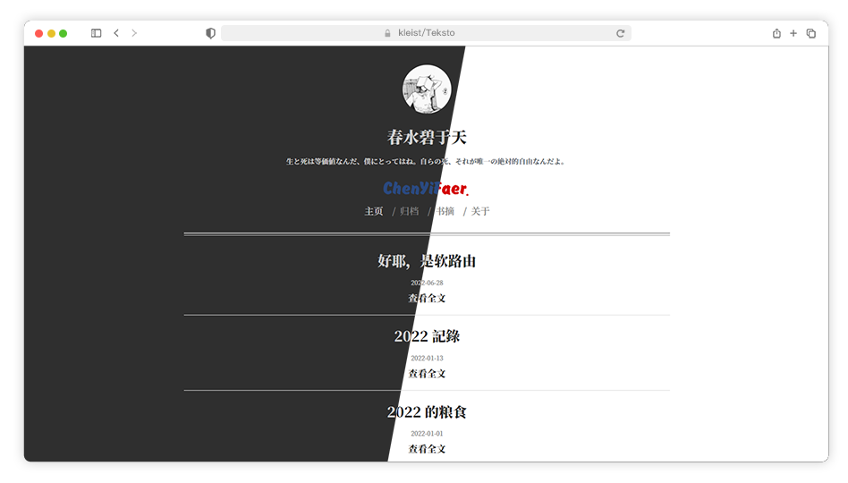

# 清文 | Teksto

这是一个几乎纯文本的 hexo 主题，从 2015 年搭建 typecho 后来换到 wordpress，最后停留在 hexo，期间换个不少主题，但每次都是自己修修改改用段时间就腻了。或许跟喝饮料喝白开水一个性质吧，尽管出门热得够呛的时候期望来一杯加冰快乐水，但长久陪伴的还是白开。所以最后就做了一个没有花里胡哨排版，尽量减少美化的主题，可能寡淡并不适合大众口味，不过无妨。



目前支持跟随系统切换暗黑模式，但由于 Windows 系统无法像 macOS 一样自动切换，所以如果需要在 Windows 实现随日出日落进行模式切换需要稍微做点手脚：

> 使用 Windows 自带的任务计划工具：
> 1. 打开任务计划工具(可以在控制面板中找到也可以搜索得到)
> 2. 右上角 - 创建基本任务 - 名称随意/描述随意 - 下一步
> 3. 触发器: 填上需要切换黑暗模式的时间,我填的是每天 18:00
> 4. 操作: 程序或脚本一栏填上 `reg.exe`,在参数一栏填上 `add HKCU\SOFTWARE\Microsoft\Windows\CurrentVersion\Themes\Personalize /v AppsUseLightTheme /t REG_DWORD /d 0 /f`, 即每天 18:00 自动将 win 主题切换为深色模式
> 5. 同样的操作, 这次需要是在早上将 win 主题深色模式改回浅色模式, 只需要将触发器的时间改为早上任意时间(我填的 7:30)即可, 另外在操作中将参数改为 `add HKCU\SOFTWARE\Microsoft\Windows\CurrentVersion\Themes\Personalize /v AppsUseLightTheme /t REG_DWORD /d 1 /f`

## 配置

``` yml
menu:
    Home: /
    Archives: /archives
    About: /About

# 页面左下角显示发发离开的天数挂件
fa: false

# 竖排版模式（暂未实现）
vertical: false

# 文章摘要
excerpt: true

# 全局目录，Markdown 里面将 toc 设为 true，但这里为 false 便不会显示。文章页面没有 toc 或 toc: false，即使这里开了也不会有目录。
toc: true

# 显示更新时间，文章更新时间是文件的最后修改时间，设为 true 会在文章页面日期后追加显示
update: true

# 深色模式 / 深色模式常开
darkmode: true
always_darkmode: false

# 网站图标
favicon: favicon.png

# 主页头像
avatar:  /imgs/avatar.png

# license
license: CC BY-NC-ND 4.0
```
## 文件树

```
Teksto
├─languages
├─layout
│  └─_partial
├─scripts
└─source
    ├─css
    │  └─_partial
    ├─imgs
    └─js
```

## 许可
MIT License
